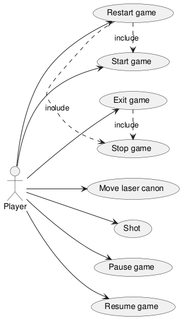
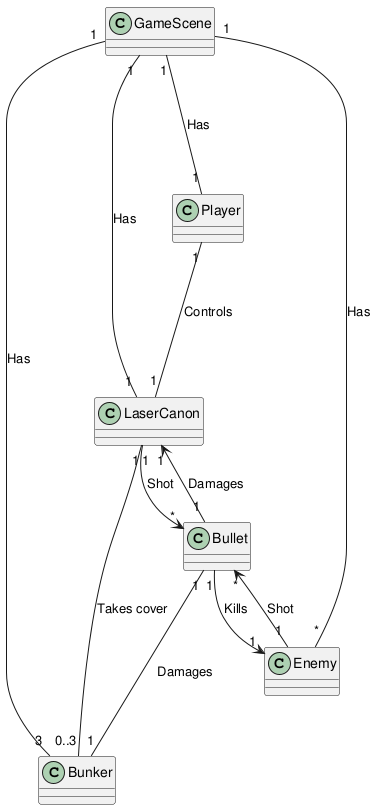

# Object oriented analyzes

This project is an [Space Invaders](https://en.wikipedia.org/wiki/space_invaders) implementation written in C ++ using the QT library.

<!-- toc -->

- [General description of the domain problem](#general-description-of-the-domain-problem)
    - [Functional Requirements](#functional-requirements)
    - [Non-functional requirements](#non-functional-requirements)
    - [Nomenclature conventions](#nomenclature-conventions)
    - [Use cases](#use-cases)
        - [Start screen](#start-screen)
        - [Game scene](#game-scene)
        - [Game menu](#game-menu)
- [Domain problem diagram](#domain-problem-diagram)

<!-- tocstop -->

## General description of the domain problem

The purpose of this game is to protect a base from an alien invasion. The aliens arrive from the sky and the player must kill them. The
player controls a laser canon, which can be used to kill spaceships.

The spaceships are computer-controlled. They continually try to shoot the laser canon.

The enemies arrives in waves of a defined number of spaceships. These waves move continuously horizontally, and gradually move to the base
of the game scene. All spaceships on the wave have the same speed and direction. They start on one side of the game scene (for example:
left) and moves horizontally to the other side (for example: right). When them reach the other side, the spaceships move down at a fixed
distance and begin to move to the other horizontal direction. If enemies arrive at the bottom of the game scene, the player dies, and the
game ends.

The player controls a laser canon that can fire bullets (lasers). Each enemy (spaceship) has its own weapon that also fires bullets. If the
player shots an enemy, the enemy dies. If the ship shots the laser canon, the player loses a live. If the player loses 3 lives, he dies, and
the game ends.

When all spaceships die, the next wave begins. Each time the player kills an enemy, his score increases.

The player can move the laser canon horizontally. It cannot move the laser canon vertically.

There are 3 bunkers that the player can use as coverage. A bunker is damaged by each shot received (including the player bullets).

The player can open a menu by pressing the ESC key. This menu pauses the game and allows the player to resume, restart or get out of the
game (exit).

### Functional Requirements

- The player must be able to move the laser canon to the left and right using keyboard arrows. The laser canon cannot leave the game scene.

- The player must be able to shoot bullets to destroy enemies.

- The game should generate several waves of enemies that move horizontally and down gradually. Enemies cannot leave the game scene.

- The game must track and display the player score based on the number of dead enemies.

- The player must have 3 lives, which decrease each time the laser canon is hit by a bullet.

### Non-functional requirements

- The game must have smooth gameplay.

- Game controls must be responsive with a low input delay.

- The game must be compatible with the Linux platform.

- The game must not crash when an unexpected input is provided (for example, pressing several keys simultaneously).

- The game must load fast (fast startup time). The player should not wait long to play the game.

### Nomenclature conventions

- The region where the game occurs (the player tries to kill enemies, etc.) is named 'Game Scene'.

- The player is the only entity that controls a laser canon; therefore, every time this documentation refers to 'laser cannon', it is
  talking about the player's laser canon.

- Enemies are the only spaceships of the game; therefore, every time this documentation refers to 'ships' or 'spaceships', it is talking
  about the 'enemies'.

- Bullets and lasers are the same thing.

### Use cases

For organization purposes, use cases are organized into: start screen, game scene and game menu.

#### Start screen

- Start game: start the game and go to the Game scene.

#### Game scene

- Move laser canon: The player can move the laser cannon only to the left and the right. It is not possible to pass from the game area.

- Shot: The player can shot bullets to enemies (ships). The player's bullets cannot damage the player, only enemies and bunkers.

- Pause Game: pause the game and open the game menu. Progress in the current gameplay is not lost.

#### Game menu

- Resume game: Get out of the game menu and return to the game scene.

- Restart game: Exit (stop) the game scene and create a new one.

- Stop game: Stop the scene of the current game, but don't go to the start screen.

- Exit game: Stop the current game scene and game menu. Return to the home screen.

## Domain problem diagram

[Prev](README.md) | [Next](projeto.md)

