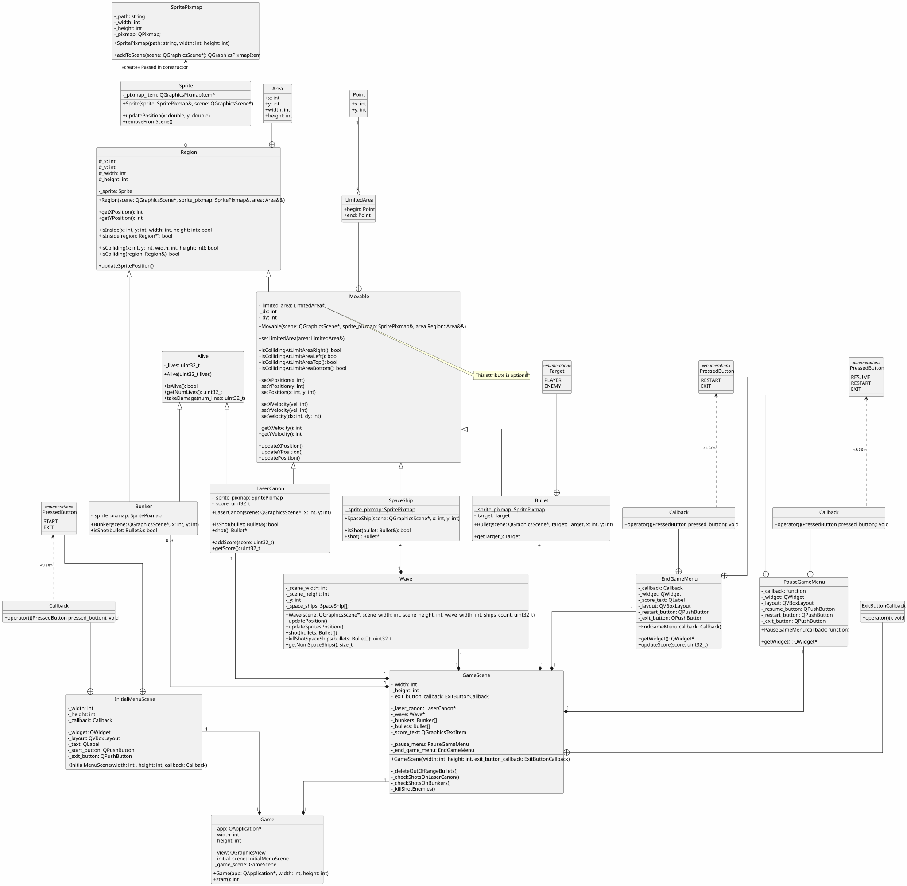
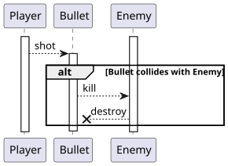
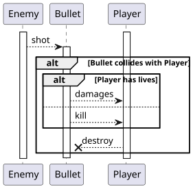
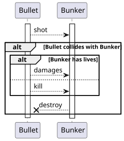

# Object oriented project

<!-- toc -->

- [Class diagram](#class-diagram)
- [Sequence diagrams](#sequence-diagrams)

<!-- tocstop -->

## Class diagram

## Sequence diagrams

Player shooting enemy:

Enemy shooting player:

Bullet shooting bunker:

[Retroceder](analise.md) | [Avançar](implementacao.md)

