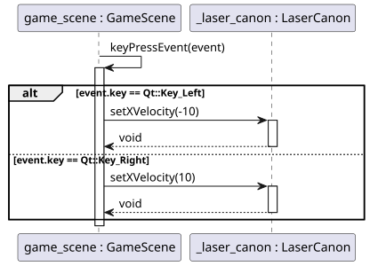
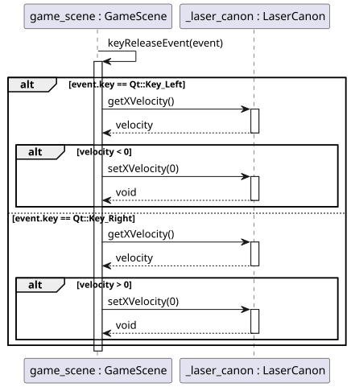
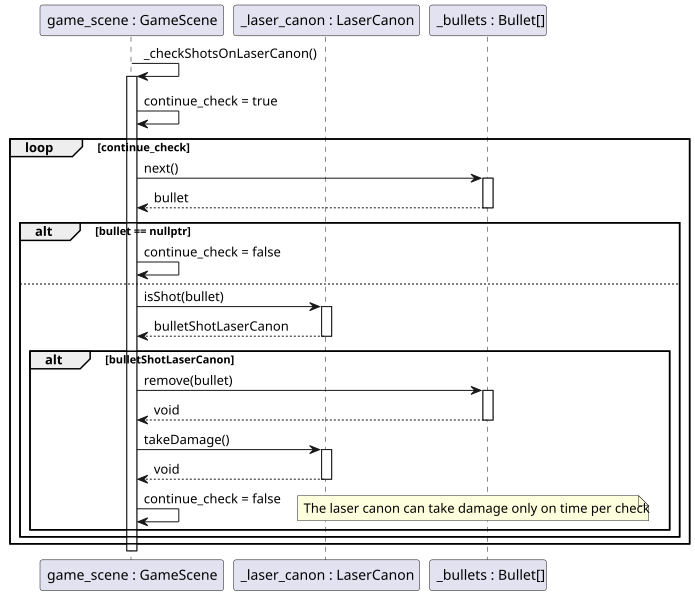
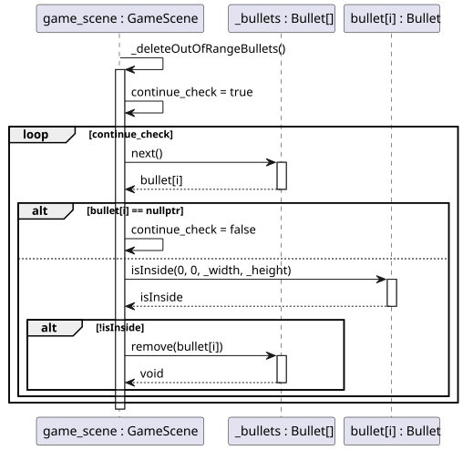

# Object oriented project

<!-- toc -->

- [Class diagram](#class-diagram)
- [Sequence diagrams](#sequence-diagrams)

<!-- tocstop -->

## Class diagram

> [!NOTE]
> The Focus of the class diagram is to show the relations between the classes. Therefore, some methods and attributes has been hidden.

## Sequence diagrams

The Player controls the laser canon with the arrow keys (left and right). The following diagrams show how the key GameScene class handles
the keyboard events (KeyPress and KeyRelease) to set the speed and direction of the laser canon.

- Key press event:

- Key release event:

Every time the player is hit, it should lose a live. The following diagram shows how the GameScene class uses the `isShot` method of the
LaserCanon class to know if the player has been hit. If `true`, it deletes the bullet and reduces the player life.

If a bullet get out of range (GameScene area), it must be deleted to free up memory. The following diagram shows how this is done.

[Retroceder](analise.md) | [Avançar](implementacao.md)

